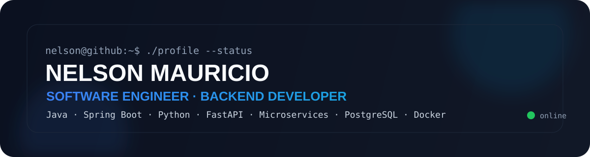
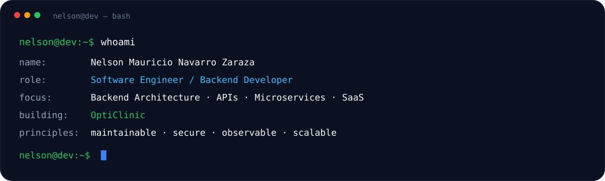

<div align="center">

<a href="https://github.com/NelsonZarazaDev">
  
</a>

<br />
<br />

<a href="https://readme-typing-svg.demolab.com">
  
</a>

<br />


</div>

---

## `$ whoami`

<p align="center">
  
</p>

I build backend platforms, APIs and SaaS products with an emphasis on **maintainable architecture, data integrity, security and scalability**.

My main ecosystem is **Java + Spring Boot**, complemented by **Python + FastAPI**, distributed systems, relational and NoSQL databases, messaging and modern frontend frameworks when the product requires end-to-end ownership.

---

## `$ cat tech-stack.yaml`

<div align="center">
<table>
<tr>
<td width="50%" valign="top">

### ⚙️ Backend

<p align="center">
  
</p>

```yaml
backend:
  - Java
  - Spring Boot
  - Spring Cloud
  - Python
  - FastAPI
```

</td>
<td width="50%" valign="top">

### 🗄️ Data

<p align="center">
  
</p>

```yaml
data:
  - PostgreSQL
  - MySQL
  - MongoDB
  - Redis
  - Flyway
```

</td>
</tr>
<tr>
<td width="50%" valign="top">

### 📨 Messaging & Integration

<p align="center">
  
</p>

```yaml
integration:
  - Apache Kafka
  - RabbitMQ
  - REST APIs
  - Event-driven systems
```

</td>
<td width="50%" valign="top">

### 🎨 Frontend

<p align="center">
  
</p>

```yaml
frontend:
  - React
  - Angular
  - Vue 3
  - TypeScript
  - Tailwind CSS
```

</td>
</tr>
<tr>
<td width="50%" valign="top">

### 🐳 Platform & Cloud

<p align="center">
  
</p>

```yaml
platform:
  - Docker
  - GitHub Actions
  - Git
  - Linux
  - AWS
```

</td>
<td width="50%" valign="top">

### 🧩 Architecture

```yaml
architecture:
  - Modular Monoliths
  - Microservices
  - Multi-tenant SaaS
  - RBAC
  - Distributed Systems
  - Clean API Design
```

</td>
</tr>
</table>
</div>

---

## `$ current_project --verbose`

<table>
<tr>
<td width="68%" valign="top">

### 🏥 OptiClinic

**Healthcare SaaS platform for optical clinics and optometry services.**

Designed around real clinical workflows with support for multiple companies and branches, patients, professionals, reservations, clinical templates, medical records, auditing and interoperability.

```yaml
architecture: modular backend + modern web frontend
backend: Spring Boot
frontend: React + TypeScript
storage: PostgreSQL + Redis
migrations: Flyway
security: OAuth2 / JWT / RBAC
interoperability: FHIR R4 / IHCE-ready design
status: active development
```

</td>
<td width="32%" valign="top">

### Core challenges

- Multi-company isolation
- Clinical versioning
- Fine-grained permissions
- Auditability
- Data integrity
- Healthcare interoperability
- Maintainable domain modeling

</td>
</tr>
</table>

> OptiClinic is currently developed in private frontend and backend repositories while the product architecture evolves.

---

## `$ ls ./featured-projects`

<table>
<tr>
<td width="50%" valign="top">

### 💉 [Vaku](https://github.com/NelsonZarazaDev/Vaku)

Vaccination management platform designed with a distributed architecture.

`Java` `Spring Boot` `Spring Cloud` `PostgreSQL`

</td>
<td width="50%" valign="top">

### 🛒 [Microservices Ecommerce](https://github.com/NelsonZarazaDev/microservices-ecommerce)

Reference implementation for catalog, inventory, ordering, configuration and service discovery.

`Spring Boot` `MongoDB` `MySQL` `PostgreSQL` `Docker`

</td>
</tr>
<tr>
<td width="50%" valign="top">

### 🧱 React Enterprise Starter

Reusable enterprise frontend foundation focused on modularity, Atomic Design and maintainable TypeScript architecture.

`React` `TypeScript` `Vite` `PrimeReact` `Tailwind` `Storybook`

</td>
<td width="50%" valign="top">

### ✅ [Commit Git](https://github.com/NelsonZarazaDev/commit-git)

Bilingual Conventional Commits generator with preview and local history.

`React` `TypeScript` `Vite`

</td>
</tr>
</table>

---

## `$ git stats --summary`

<div align="center">


</div>

> GitHub language statistics reflect public repository files and are not a measure of proficiency.

---

## `$ roadmap --now`

```text
[01] Build production-grade SaaS architecture
[02] Deepen distributed systems and messaging patterns
[03] Improve observability, testing and CI/CD practices
[04] Continue developing cloud skills with AWS
[05] Ship software that solves real operational problems
```

---

## `$ connect --socials`

<div align="center">

<a href="https://www.linkedin.com/in/nelson-mauricio-navarro-zaraza-3448542a5/">
  
</a>
&nbsp;
<a href="https://portfolio-mocha-seven-5wlv6hjrj5.vercel.app">
  
</a>
&nbsp;
<a href="https://github.com/NelsonZarazaDev">
  
</a>

<br />
<br />

<sub><code>nelson@dev:~$ build something useful_</code></sub>

</div>
